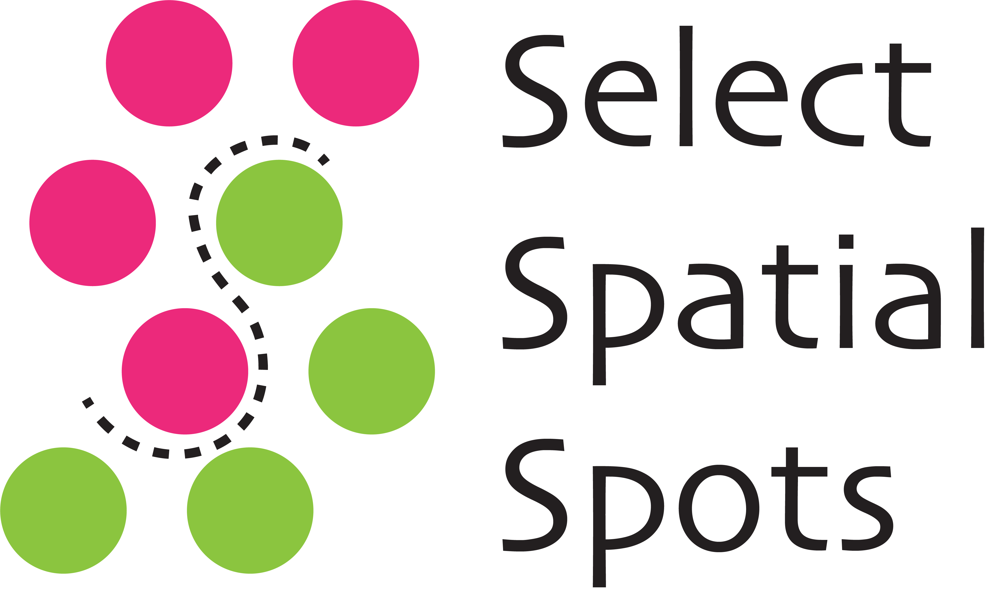
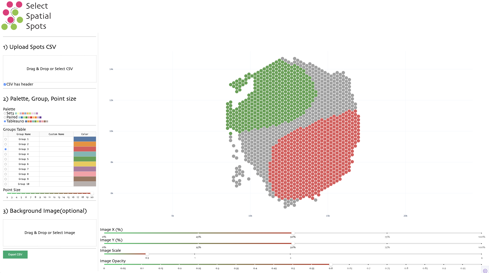
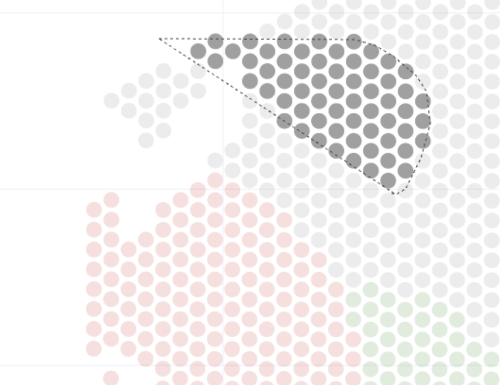

# Abstract
It is a __Dash__ app for Spatial Transcriptome Analysis, especially the part of selecting spots of interest interactively. You can get a spots assignment csv for downstream analysis.
- Example:

- Just __Drag__(after __Selecting The Group__ at _Step 2_ on the left side):

# Quick Start

- clone this repository
- install the requirements
```bash
pip install requirements
```
- run the app
```bash
py app.py
```
- prepare your csv and image(optional, and smaller for faster)
    - csv colnames: `CELL_ID`, `X`, `Y`
    - image: no larger than 5mb for faster processing, this app is just for spots selecting and you can add image with higher resolution laterly.

- Align Your Image with `X`, `Y`, `Scale` Slider on the right bottom(Under the Spots Graph).

- Select the color and enter the group name you want to use

- Select Spots with lasso(Drag Your mouse to cover the spots), and the selected spots would be assigned with the group activated

- Export the assignment csv(with custom name on the _group table_ added)

# Reference

Data used as example in this README from: [Assessment of spatial transcriptomics for oncology discovery](https://linkinghub.elsevier.com/retrieve/pii/S2667-2375(22)00237-5) 

​    
